# Moiré Warp & Pattern Nodes 🌀📐

<!-- markdownlint-disable MD060 -->

A suite of modular nodes for ComfyUI designed for creating complex Moiré patterns, conformal mappings, and advanced coordinate distortions.

---

## Why Moiré Nodes? 🧠✨

Most users don't realize that **adding noise back into an image** is the secret engine of high-end detail refinement. By injecting noise into a latent, you give the diffusion model "permission" to redraw and enhance the structure.

However, the *type* of noise you use determines the final look:

- **Random Noise**: Leads to unpredictable, chaotic textures that can sometimes blow out or create muddy areas.
- **Perfect Grid Noise**: Can cause "digital" or "screen-door" artifacts that are immediately noticeable to the human eye.
- **Moiré (Structured) Noise**: This is the sweet spot. Moiré patterns are **irregular yet mathematically consistent**. They provide an organic, flow-like **"structural skeleton"** for the diffusion process to wrap around.

Because the flow is complex and non-repetitive, the resulting refinement tends to produce more **organic, natural results** than simple random noise or rigid grids. You're giving the model a sophisticated blueprint to follow rather than just a pile of bricks.

---

### 🚀 Simple Start, Infinite Depth

- **No Math Required**: You don't need to understand complex analysis or conformal maps to get the benefit. Simply plugging a `Moiré Renderer` into your workflow provides an immediate structural boost to your noise.
- **Overboard Power**: While it started as a simple Moiré tool, we've gone "overboard" and added a full suite of complex-plane analysis tools. This has transformed the package from a simple noise generator into a powerful general-purpose distortion and mathematical art engine—so now it does so much **more than Moiré**.

---

## The Modular Workflow

The new modular system allows for infinite creativity by separating coordinates, distortions, and rendering.

### 1. Coordinates 🧩

Start with the **Moiré Coordinates** node. It creates a normalized grid `[-1, 1]` that describes the "space" your pattern will live in ($z = x + iy$).

### 2. Warps (Distortions) 🌀🌊

Chain any number of warp nodes together to distort the coordinate grid. These are resolution-independent and stackable through **Functional Composition**.

#### Standard Warps

| Distortion     | Formula                                                   | Description                                     | Visual Sample                        |
| :------------- | :-------------------------------------------------------- | :---------------------------------------------- | :----------------------------------- |
| **Noise**      | $z' = z + \sum A_n \text{noise}(f_n z)$                   | Multi-octave pseudo-random displacement.        | 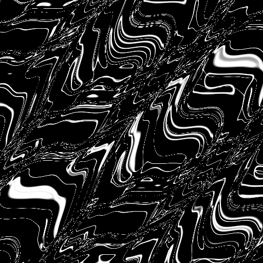           |
| **Wave**       | $z' = z + \sum A \sin(\omega \pi \cdot \text{proj}_i(z))$ | Multiple intersecting wave patterns.            | 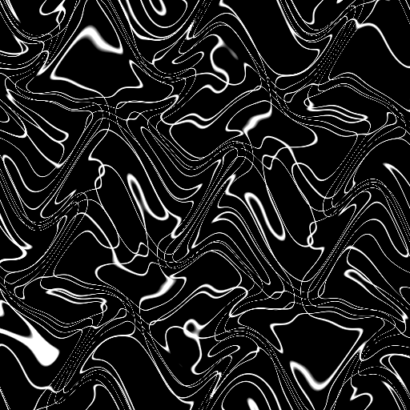             |
| **Sinusoidal** | $x' = x + A \sin(\omega y)$                               | Wave-based displacement.                        | 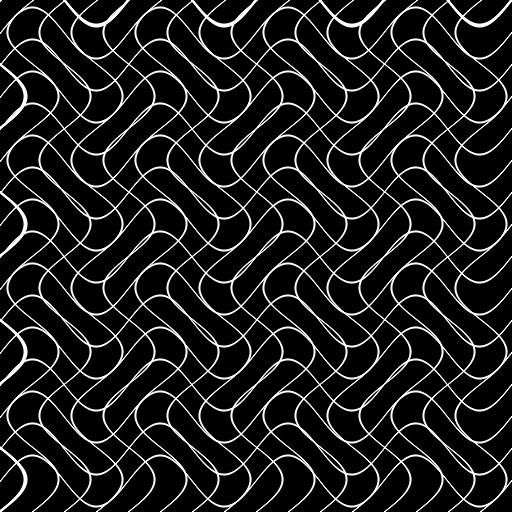 |
| **Bulge**      | $f(z) = C + (z-C)(1 + k e^{-3\|z-C\|})$                   | Radial expansion or contraction around a point. | 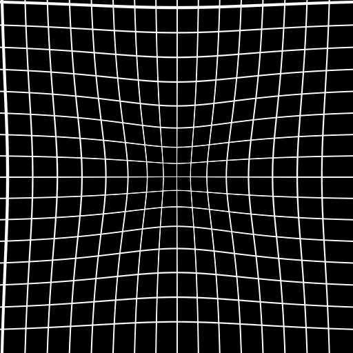           |
| **Swirl**      | $f(z) = z e^{i \theta}$                                   | Rotational twisting with exponential falloff.   | 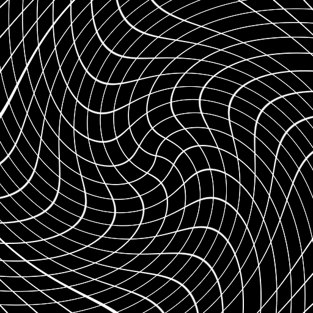           |
| **Barrel**     | $f(z) = z(1 + k_1\|z\|^2)$                                | Lens-style barrel or pincushion distortion.     | 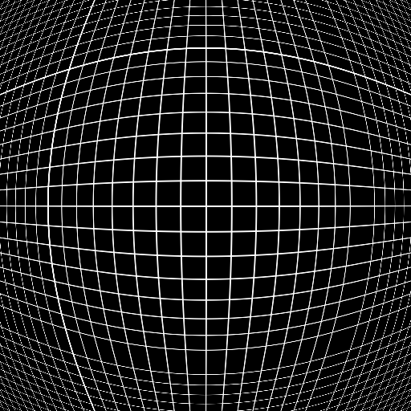         |
| **Ripple**     | $f(z) = z + A \sin(\omega \|z\|) \frac{z}{\|z\|}$         | Concentric radial waves.                        | 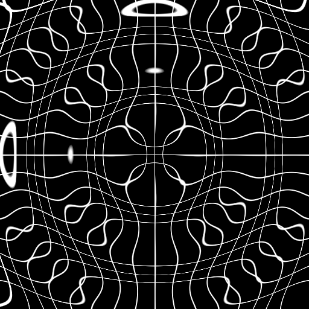         |
| **Shear**      | $x' = x + k_x y, y' = y + k_y x$                          | Linear directional slant.                       | 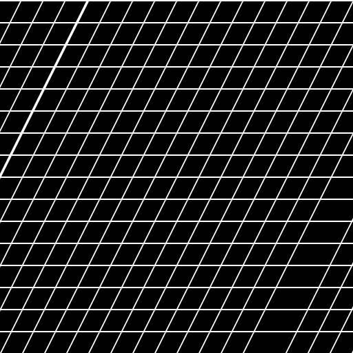           |
| **Fisheye**    | $f(z) = z \frac{\text{atan}(\|z\|k)}{\|z\|k}$             | Extreme wide-angle lens mapping.                | 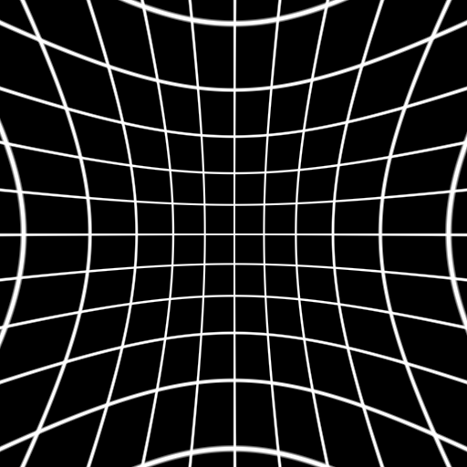       |
| **Twist**      | $f(z) = z e^{i k \|z\|}$                                  | Rotational distortion increasing with distance. | 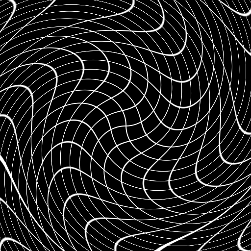           |

#### Complex Plane (Conformal) Warps 📐

These nodes treat the coordinate grid as a complex plane ($z = x + iy$), allowing for deep mathematical distortions that preserve local shapes and angles.

| Transformation        | Formula                      | Description                                                              | Visual Sample                          |
| :-------------------- | :--------------------------- | :----------------------------------------------------------------------- | :------------------------------------- |
| **Complex Log**       | $w = \log(z)$                | Unwraps circles into a rectangular grid.                                 | 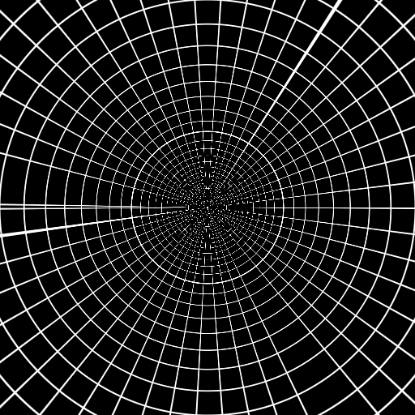 |
| **Complex Exp**       | $z = e^w$                    | Wraps a grid back into spirals/circles.                                  | 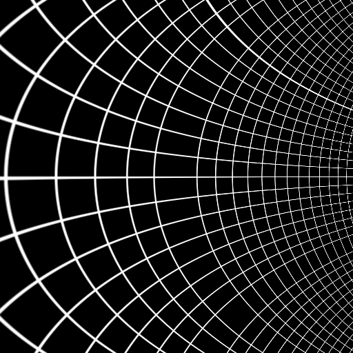 |
| **Complex Power**     | $z' = z^c$                   | An all-in-one zoom/spiral/twist.                                         | 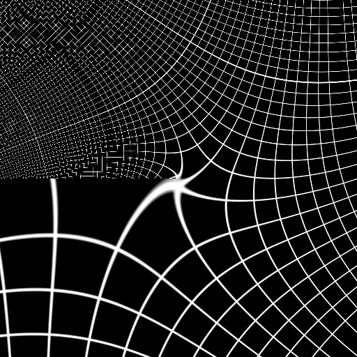 |
| **Complex Linear**    | $z' = az + b$                | Scaling, rotation, and translation ($a$ scales/rotates, $b$ translates). | 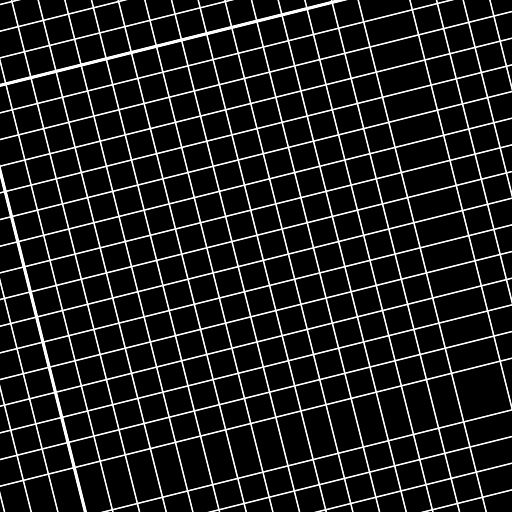 |
| **Complex Inversion** | $z' = 1/z$                   | Maps the "inside out" (Circle Inversion).                                | 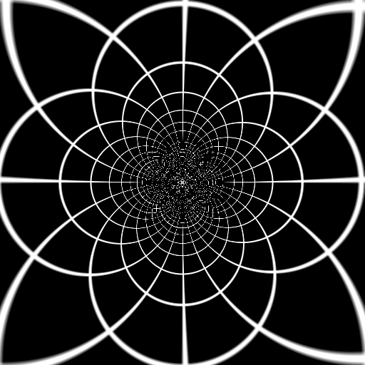 |
| **Complex Sine**      | $z' = \sin(z)$               | Creates beautiful periodic conformal waves.                              | 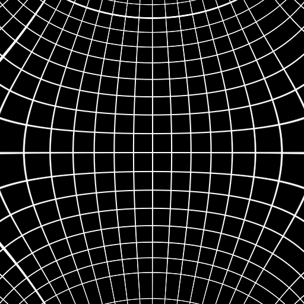 |
| **Complex Cosine**    | $z' = \cos(z)$               | Periodic tiling with vertical focal points.                              | 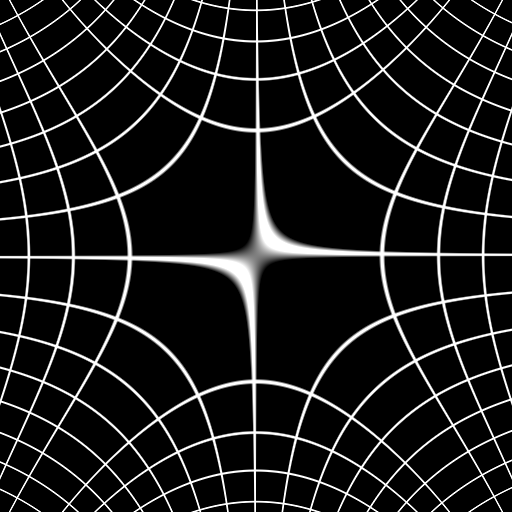 |
| **Complex Tangent**   | $z' = \tan(z)$               | Maps the plane to a repeating disk-like grid.                            | 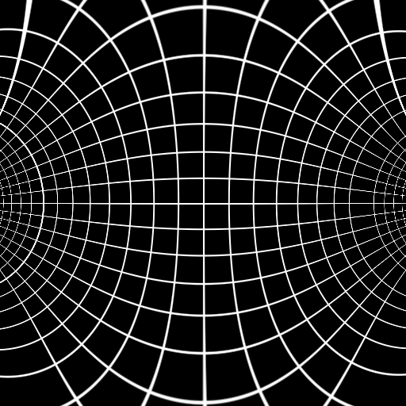 |
| **Complex Hyperbolic**| $z' = \sinh, \cosh, \tanh$   | Hyperbolic mappings for non-Euclidean aesthetics.                        | 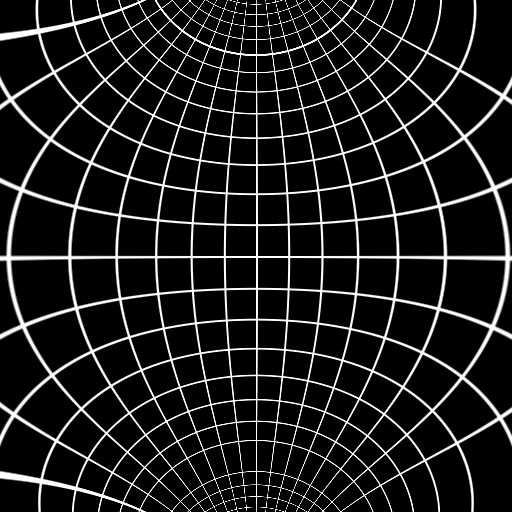 |
| **Complex Power N**   | $z' = z^{n}$                 | Sector expansion/compression (e.g. $z^2$).                               | 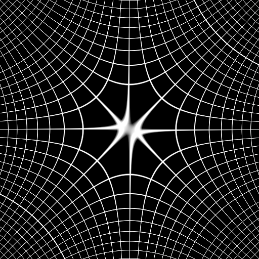 |
| **Complex Möbius**    | $z' = (az+b)/(cz+d)$         | The most general conformal map (Möbius transform).                       | 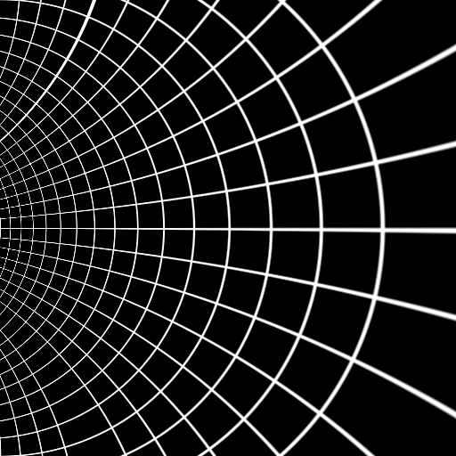 |

---

## Noise Flavor Guide 🎲🧪

The `Moiré Noise Generator` provides several "flavors" of spectral and cellular noise. Each has a specific role in creating a sophisticated structural skeleton for diffusion.

### Spectral Noise (Filtered White Noise)

|         **White Noise**        |         **Blue Noise**         |      **Pink Noise ($1/f$)**    |   **Brownian Noise ($1/f^2$)** |
| :----------------------------: | :----------------------------: | :----------------------------: | :----------------------------: |
| 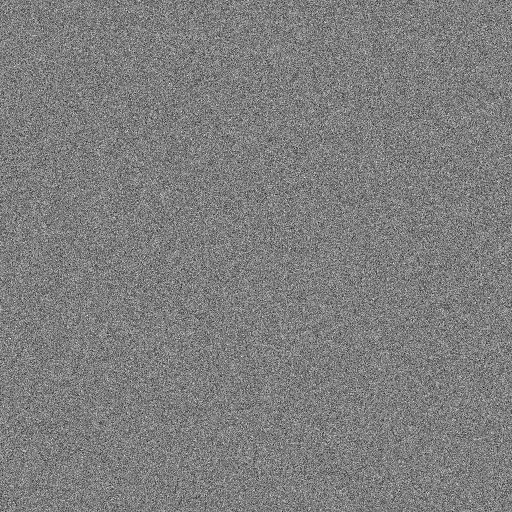|  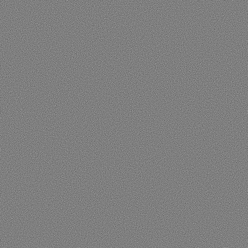 |  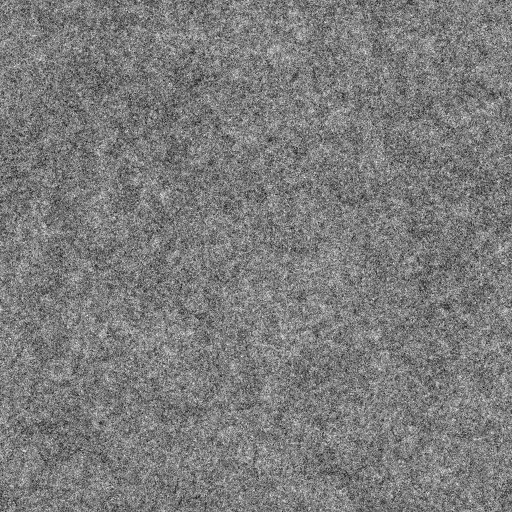 | 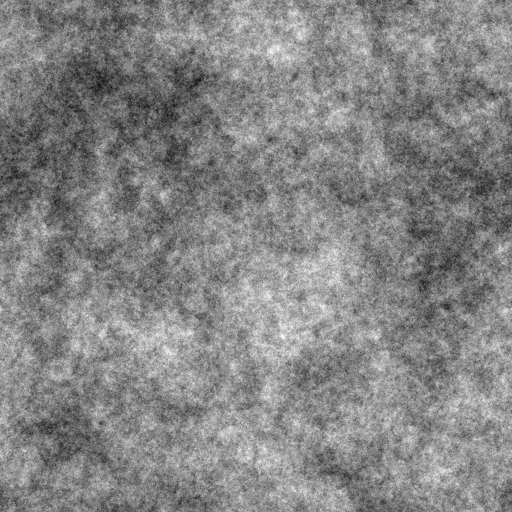 |
|        **Chaotic & Raw**       |    **High-Frequency & Even**   |      **Organic & Natural**     |     **Soft & Atmospheric**     |
| Equal energy across all frequencies. Good for raw dither. | High-pass filtered to remove clumping. Perfect for fine skin/fabric grit. | The "natural" frequency balance. Mimics biological textures and clouds. | Low-frequency focus. Ideal for soft smoke, terrain, or fog skeletons. |

### Structural & Oriented Noise

|     **Voronoi (Cellular)**     |      **Gabor (Oriented)**      |
| :----------------------------: | :----------------------------: |
| 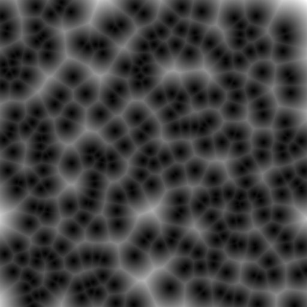 | 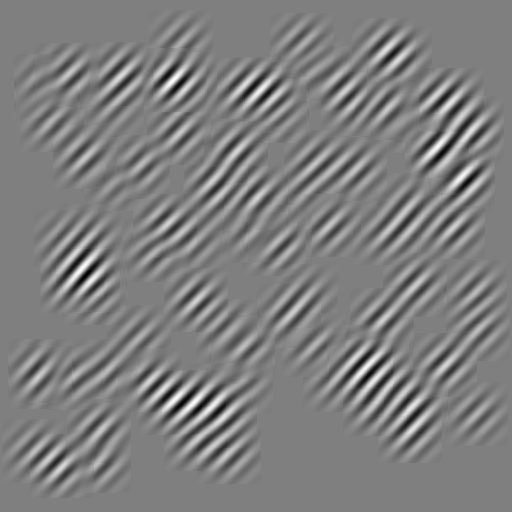 |
|   **Crystalline & Shattered**  |  **Structured & Directional**  |
| Distance fields from random seed points. Great for skin cells, scales, or stained glass. | Localized sinusoids with orientation control. The ultimate "Moiré" structural skeleton. |

---

## Comparison: Displacement vs. Source Texture 🔄🎲

Understanding the difference between the two ways to use noise in this suite is key to achieving high-end results.

| Feature     | **Moiré Warp Noise**                 | **Moiré Noise Generator**             |
| :---------- | :----------------------------------- | :------------------------------------ |
| **Type**    | **Displacement** (Coordinate Shift)  | **Source Pattern** (Raw Texture)      |
| **Logic**   | `Coords` -> `Warp` -> `Renderer`     | `Coords` -> `Noise Gen` -> `Renderer` |
| **Visual**  | 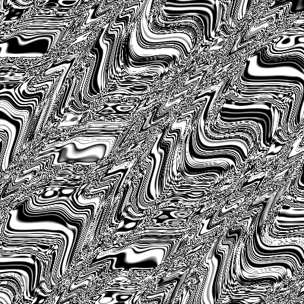 |       |
| **Effect**  | "Wiggles" your geometric grid lines. | Produces raw, natural grain or cells. |
| **Best For**| Smooth, undulating wave distortions. | **"Structural Skeletons"** for refinement. |

---

## The Mathematics of Chaining 🔗

When you chain warping nodes, you are performing **Functional Composition**:
$$z_{final} = f(g(h(z_{initial})))$$

### Types of Stacking

1. **Additive Displacement**: Modules like `Moiré Warp Noise` or `Shear` act by adding a vector to your current coordinate: $z' = z + v$. This is the most "physical" way to think about warping—like sliding a sheet of rubber. While intuitive, it is **non-conformal**, meaning it doesn't preserve local angles or shapes. If you push two regions towards each other, you get compression and "messy" overlaps, which is exactly how traditional Moiré interference patterns are formed.
2. **Multiplicative / Conformal Transformations**: The complex plane nodes (Log, Exp, Power, etc.) perform a multiplicative transformation: $z' = f(z)$. These are **conformal**, meaning they perfectly preserve the local structure and angles of your pattern even under extreme distortion. This is why you can chain a Power mapping $z^2$ and the result still looks like a clean (though doubled) grid, rather than a smeared one.
3. **Domain Transformation (Sandwiching)**: `Complex Log` and `Complex Exp` change the *coordinate system itself*. Chaining a transformation *between* a Log and an Exp allows you to perform operations in the "unwrapped" plane ($w$-plane) that affect the "wrapped" output ($z$-plane) in unique ways. For example, a simple shift in the $w$-plane becomes a rotation or zoom in the $z$-plane.

---

## Deep Dive: The Escher / Droste Effect 🖼️🌀

The famous "Droste effect" (self-similar infinite zoom) is achieved through a specific sequence of complex transformations. You can see the mathematical breakdown in this [excellent video by 3Blue1Brown](https://youtu.be/ldxFjLJ3rVY).

### How to Build it with Moiré Nodes

1. **Coordinate Initialization**: Start with `Moiré Coordinates`.
2. **Complex Log**: Use `Moiré Complex Log` to **unwrap the recursive grid**. Since the grid is centered at the origin, the log transform turns the "box-within-box" structure into a **tiled, axis-aligned pattern** in the log-polar plane ($w = \log z$).
3. **Complex Linear (The Slant)**: Use `Moiré Complex Linear`. By rotating or slanting this tiled pattern, you ensure that the tiles **align diagonally**. This creates the "spiral pitch" required for the Droste loop.
4. **Complex Exp**: Use `Moiré Complex Exp` to wrap the tilted plane back into the radial space. This creates the infinite spiral zoom effect where the boxes now flow into each other seamlessly.
5. **Multi-Grid Render**: Render your pattern. The resulting grid elements will now be **perfectly aligned spirals** that zoom into themselves infinitely as the tiling repeats across the plane.

#### Visual Step-by-Step

|      0. Base Grid (16x16)     |         1. Complex Log        |       2. Linear (Slant)       |    3. Complex Exp (Droste)    |
| :---------------------------: | :---------------------------: | :---------------------------: | :---------------------------: |
| 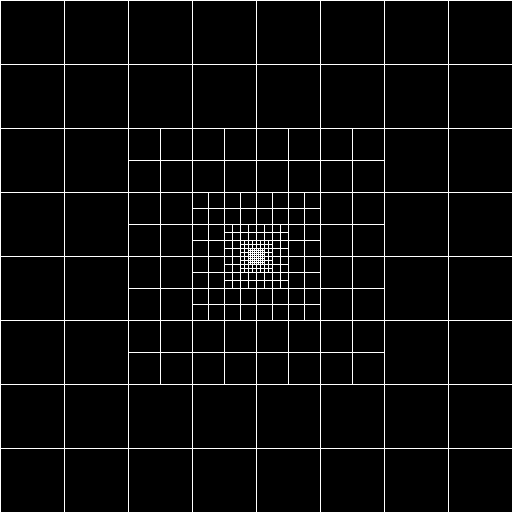 | 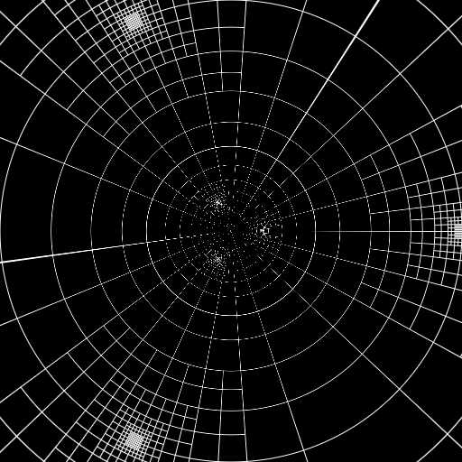 | 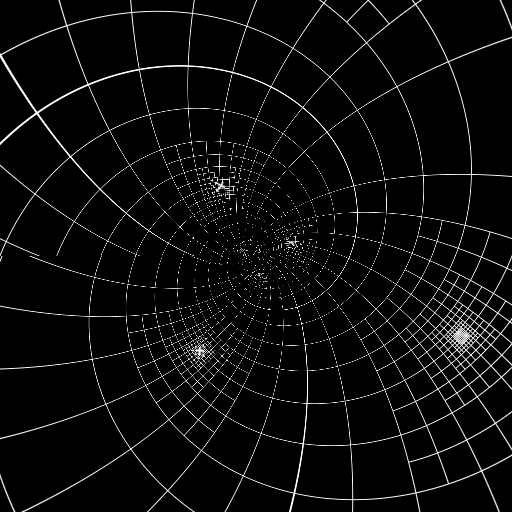 | 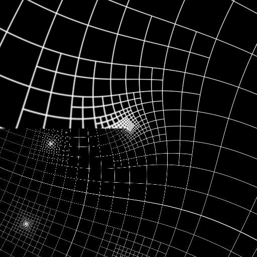 |

---

### 3. Renderers 🎨🎭

Apply a pattern to your distorted coordinates to generate a final result.

- **Moiré Renderer**: Generates a single-layer pattern (Checker, Grid, or Dots).
- **Moiré Multi-Grid Renderer**: Layers multiple patterns with complex blend modes (Add, Multiply, XOR, Difference).

### 4. Image/Mask Warping 🖼️

Use the **Moiré Image Warp** node to apply your coordinate distortions to an existing image or mask instead of rendering a grid pattern.

## Legacy Support 📜

The original monolithic nodes have been moved to `py/legacy_moire.py` for backward compatibility. They appear in the `Legacy` category.

## Requirements

- `numpy`
- `torch`
- `scipy` (Required for image/mask warping operations)
